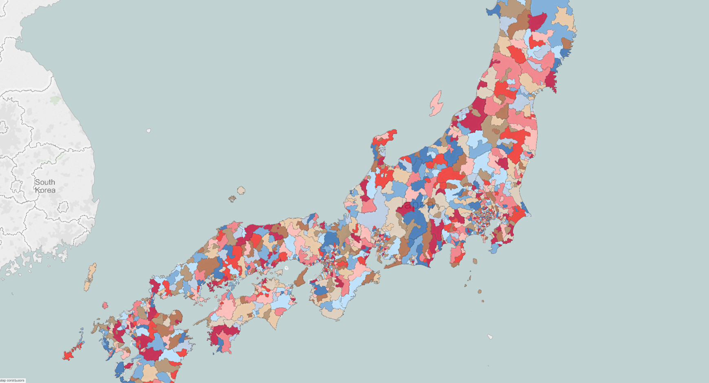

# Preamble: Everything you need to know about Japan's geography

Let's talk about Japan.

And let's start by talking about Japan's socio-political geography.

Japan is a country, in east asia, with no land borders to any other countries. It's an archipelago, but the 5 biggest islands that make up Japan are (in order) [0]:

  - Honshuu
  - Hokkaidou
  - Kyuushuu
  - Shikoku
  - Okinawa

You may have seen these spelled differently depending on the source.

Japan has 47 prefectures, known as «todoufuken» (都道府県) in japanese. In fact, japanese prefectures don't all have identical political roles. There are 4 types of prefecture:

  - 1 metropolitan area («都», «to»)
  - 1 circuit («道», «dou»)
  - 2 fu («府», «fu») [1]
  - 43 counties («県», «ken») [2]

Each of these types bears slightly different political power. For example, Tokyo-to is made up of districts (特別区) which have slightly more political power than regular provincial subdivisions.

##### A map labeling the prefectures of japan (english)
.gif)

## Post codes in Japan

Like many countries, Japan uses post codes to help write addresses succinctly and unambiguously. Japanese postcodes take the form

`NNN-NNNN`

where N is a number. Using a regular expression, that's

`\d{3}-\d{4}`

We'll quite often be using post codes and place names to talk about the geography of japan.

##### A map coloring the different post code areas of Japan

source: https://public.tableau.com/en-us/s/blog/2015/12/tableau-public-92-now-mapbox-integration

## Foot-notes

[0] Not accounting for disputed Kuril islands.

[1] (Translation note) The best translation I can find for this word is «(government) office». But, it seems standard in English to use the word «fu» without translation.

[2] (Translation note) The Peoples' Republic of China calls these «counties», and writes them with the same [3] character. In chinese history, this word had different political status, and so usually get translated as «prefecture» (as is common in modern Japan) or as «district» when refering to the historical meaning. The japanese government uses the word «prefecture» to mean «todoufuken» (都道府県), that is, *all 4* of these categories. This steers me away from translating «ken» as «prefecture». 

The United Kingdom uses «county» as its top-level political subdivision, and these counties bear similar political power to japanese «ken». Given the similarity between these two governmental systems; and the similarity with the chinese word, I choose to translate this as «county».

[3] Same character, but simplified differently between japan and china. Chinese (traditional): 懸; Chinese (simplified): 县; Japanese: 県.
